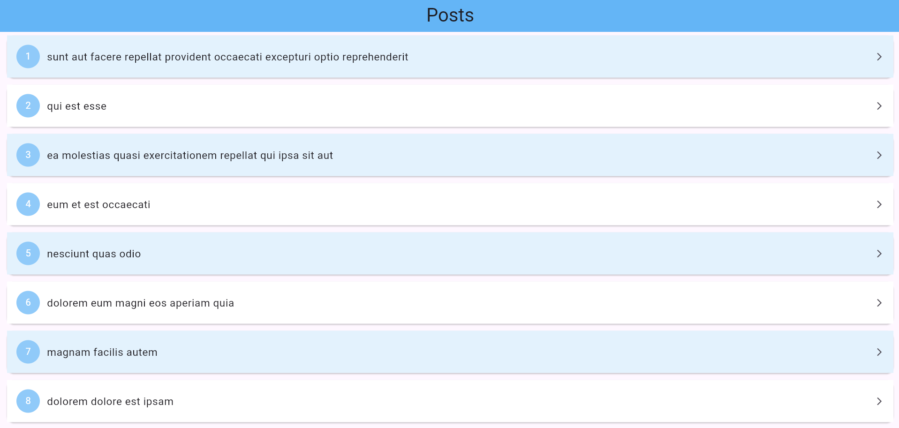
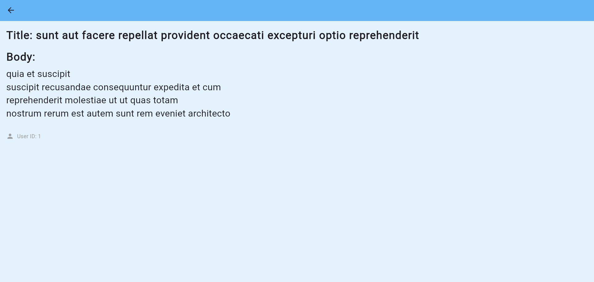

# Posty - Aplikacja do przeglądania postów

Aplikacja Flutter do przeglądania postów z API. Wyświetla listę postów oraz szczegóły wybranego postu.

## Technologie

- **Flutter** (v3.0+)
- **Riverpod** (stan management)
- **Go Router** (nawigacja)
- **Dio** (HTTP requests)

## Struktura projektu

```plaintext
lib/
├── app_router.dart        # Konfiguracja routingu
├── main.dart              # Główny plik aplikacji
├── models/
│   └── post.dart          # Model danych posta
├── pages/
│   ├── home_page.dart     # Ekran główny z listą postów
│   └── postdetail_page.dart # Ekran szczegółów postu
├── providers/
│   └── post_provider.dart # Dostawcy danych
└── utils/
    └── HeadingText.dart   # Widget tekstu nagłówkowego
```

## Screenshoty

### Ekran główny



### Ekran szczegółów



## Autor

Projekt wykonał Tomasz Rogalski.  
Wykonano w ramach zadania rekrutacyjnego.

---

Dziękuję za poświęcony czas na zapoznanie się z projektem!
